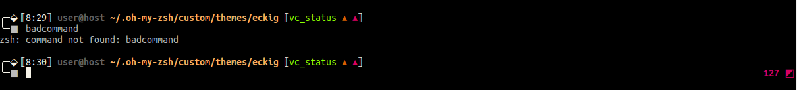

# eckig
A minimal zsh prompt theme

# Screenshot

# Installation

Clone the repository into your custom `oh-my-zsh` themes directory:

    # git clone https://github.com/fouladi/eckig.git $ZSH_CUSTOM/themes/eckig

Make a symbolic link `eckig.zsh-theme` to your `oh-my-zsh` themes
directory:

    # ln -s "$ZSH_CUSTOM/themes/eckig/eckig.zsh-theme" "$ZSH_CUSTOM/themes/eckig.zsh-theme"
    
And set 
    
    ZSH_THEME="eckig/eckig"

in your `.zshrc`.
